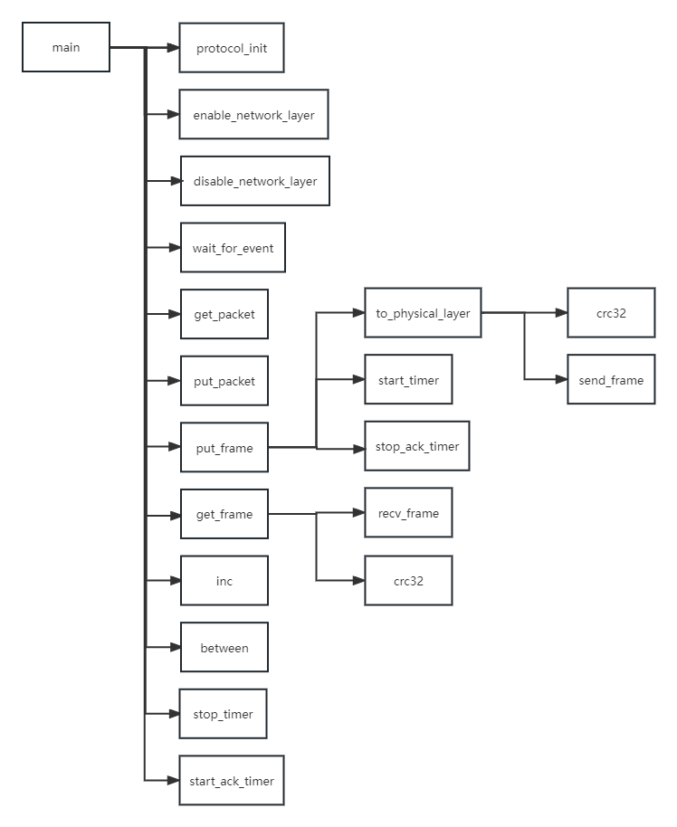
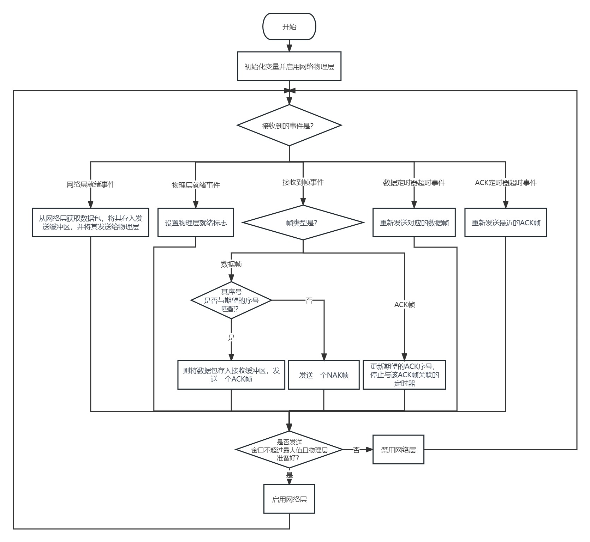
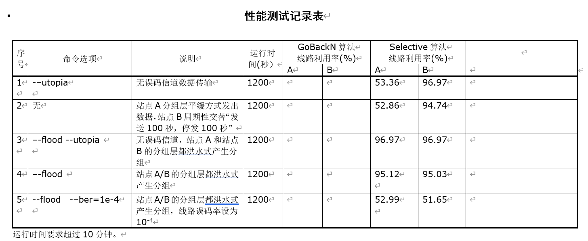

# 实验一 数据链路层滑动窗口协议的设计与实现

## 1 实验内容和实验环境描述

### 实验内容

利用所学数据链路层原理，自己设计一个滑动窗口协议，在仿真环境下编程实现有噪音信道环境下两站点之间无差错双工通信。

我所实现的是 稍带确认、有 NAK、有单独 ACK 的选择重传协议

### 实验环境

- Win10 WSL2 下 Ubuntu 22.04.1 LTS
- VSCode 编辑器

## 2 软件设计

### 数据结构

宏定义

```c
#define DATA_TIMER 7400						// 重传计时器的计时时间
#define ACK_TIMER 2000						// 发ACK计时器的计时时间
#define MAX_SEQ 31							// 帧序号的最大值
#define NR_BUFS ((MAX_SEQ + 1) / 2)			// 选择重传协议的窗口大小
```

帧格式结构体

```c
#define PKT_LEN 256							// 帧的数据部分长度

typedef unsigned char packet[PKT_LEN];		// 帧的数据字段

typedef struct {
    unsigned char kind;						// 帧类型
    unsigned char ack;						// ACK序号
    unsigned char seq;						// 帧序号
    packet data;							// 数据部分
    unsigned int crc;						// 校验位
} frame;
```

全局变量

```c
static boolean no_nak = true;				// 当前未发NAK状态标识符
static int phl_ready = 1;					// 物理层准备就绪状态标识符

static packet out_buf[NR_BUFS];				// 发送窗口缓冲区
static packet in_buf[NR_BUFS];				// 接收窗口缓冲区
static boolean arrived[NR_BUFS];			// 已到达帧记录数组

static unsigned char ack_expected;			// 发送窗口内希望收到ACK的窗口下标（窗口最左端下标）
static unsigned char next_frame_to_send;	// 发送窗口内下一个要从网络层接收并发送帧的序号
static unsigned char frame_expected;		// 接收窗口内希望接收到帧的序号
static unsigned char too_far;				// 接收窗口右端点的后一个下标
static unsigned char nbuffered;				// 发送窗口缓冲区已经缓存的帧数量

static frame r;								// 临时存放从物理层接收的帧
```

### 模块结构

给帧序号加一（超过最大帧序号后回滚）：

```c
/**
 *  seq  需要增加序号的变量的指针
 */
void inc(unsigned char *seq)
{
    *seq = (*seq + 1) % (MAX_SEQ + 1);
}
```

判断某个序号当前是否在窗口内：

```c
/**
 *  a  窗口左端下标
 *  b  要判断的下标值
 *  c  窗口右端下标的后一个值
 *  return 是否在窗口内
 */
boolean between(unsigned char a, unsigned char b, unsigned char c)
{
    // abc bac bca
    return ((a <= b) && (b < c) || (c < a) && (a <= b) || (b < c) && (c < a));
}
```

给帧加校验位并将帧发送给物理层：

```c
/**
 *  frame  要发送帧的指针
 *  len    不加校验位帧的长度
 */
void to_physical_layer(unsigned char *frame, int len)
{
    *(unsigned int *)(frame + len) = crc32(frame, len); // 加校验位
    send_frame(frame, len + 4); // 使用库函数发送帧
    phl_ready = 0; // 已经给物理层发送帧，物理层准备状态置为0
}
```

填入帧内容并发送物理层：

```c
/**
 *  fk              帧类型
 *  frame_nr        帧序号
 *  frame_expected  接收窗口希望收到的帧窗口下标
 *  buffer          发送窗口数组
 */
void put_frame(unsigned char fk, unsigned char frame_nr,
               unsigned char frame_expected, packet buffer[NR_BUFS])
{
    // 成帧
    frame s;

    s.kind = fk;
    s.seq = frame_nr;
    s.ack = (frame_expected + MAX_SEQ) % (MAX_SEQ + 1);

    // 单独发送ACK
    if (fk == FRAME_ACK) {
        dbg_frame("Send ACK %d\n", s.ack);
        to_physical_layer((unsigned char *)&s, 2);
    }

    // 发送NAK
    if (fk == FRAME_NAK) {
        dbg_frame("Send NAK %d\n", s.ack);
        no_nak = false;
        to_physical_layer((unsigned char *)&s, 2);
    }

    // 发送数据帧
    if (fk == FRAME_DATA) {
        memcpy(s.data, buffer[frame_nr % NR_BUFS], PKT_LEN);
        start_timer(frame_nr, DATA_TIMER);
        dbg_frame("Send DATA %d %d, ID %d | ack_expected=%d, next_frame_to_send=%d\n",
            s.seq, s.ack, *(short *)s.data, ack_expected, next_frame_to_send);
        to_physical_layer((unsigned char *)&s, 3 + PKT_LEN);
    }

    // 关闭ACK计时器
    stop_ack_timer();
}
```

从物理层收一帧并做校验：

```c
/**
 *  r  帧指针
 *  return 是否接收成功
 */
boolean get_frame(unsigned char *r)
{
    // 从物理层收帧并返回帧长
    int len = recv_frame(r, sizeof(*(frame*)r));

    // 帧长小于6或者校验出错，收到坏帧，丢弃并返回false
    if (len < 6 || crc32(r, len) != 0) {
        dbg_event("**** Receiver Error, Bad CRC Checksum\n");
        return false;
    }
    return true;
}
```

函数调用关系图



### 算法流程



## 3 实验结果分析

> (1) 描述你所实现的协议软件是否实现了有误码信道环境中无差错传输功能。

我所实现的协议软件实现了有误码信道中无差错传输功能

> (2) 程序的健壮性如何，能否可靠地长时间运行。

程序的健壮性良好，可以可靠地长时间运行

> (3) 协议参数的选取：滑动窗口的大小，重传定时器的时限， ACK搭载定时器的时限，这些参数是怎样确定的？根据信道特性数据，分组层分组的大小，以及你的滑动窗口机制，给出定量分析，详细列举出选择这些参数值的具体原因。

**最大帧序号为 31，窗口大小为 16**

信道带宽为 8000 bps，单程传播时延为 270ms，使用稍带确认
$$
u=\cfrac{W}{2(1+\alpha)}\\
\alpha = \cfrac{t_{propagation}}{t_{transmission}}\\
t_{transmission} = \cfrac{packet\_len}{transmission\_rate}\\
$$
其中
$$
packet\_len = 256+1+1+1+4{\rm B}=263{\rm B}\\
transmission\_rate = 8000{\rm bps}\\
t_{propagation} = 270{\rm ms}
$$
求得
$$
u=W/4.1\ge 100\%\\
W \ge 5
$$
但经过测验，由于误码的存在，将窗口大小的值设置为 16 能达到较高的信道利用率，经计算最大帧序号为 31

**重传定时器时限设置为 7400 ms，ACK 定时器时限设置为 2000ms**

重传定时器设置为两倍传播时延加一个 ACK 定时器时延比较合适

ACK 定时器设置为 2000ms，则重传定时器为 2700 * 2 + 2000 = 7400ms

>  (5) 理论分析：根据所设计的滑动窗口工作机制 (Go Back N或者选择重传 )，推导出在无差错信道环境下分组层能获得的最大信道利用率；推导出在有误码条件下重传操作及时发生等理想情况下分组层能获得的最大信道利用率。给出理论推导过程。理论推导的目的是得到信道利用率的极限数据。为了简化有误码条件下的最大利用率推导过程，可以对问题模型进行简化，比如：假定超时重传的数据帧的回馈ACK帧可以 100%正确传输，但是简化问题分析的这些假设必须不会对整个结论产生较大的误差。

- 在无差错信道环境下分组层能获得的最大信道利用率：

根据帧的数据结构定义，最大的信道利用率 = 携带的数据量(bytes) / 传输的帧长(bytes) = 256 / (1 + 1 + 1 + 256 + 4) × 100 % ≈ 97.34 %

本次实验未考虑数据链路层添加的帧头和帧尾，用于帧定界，实际上如果帧内比特串和标志字节相同时，还会插入转义符，使帧变长。

数据链路层提供的服务为 8000 bps，即每 1 ms 传输 1 字节。

本实验有 1 ms 的帧间距，相当于 1 个无用字节。

在无差错的信道上传输时，最大的信道利用率为 256 / (1 + 1 + 1 + 256 + 4 + 1) × 100 % ≈ 96.97 %

- 在有误码条件下重传操作及时发生等理想情况下分组层能获得的最大信道利用率：

现考虑在物理层误码率为 10^{−5} 的信道上发送帧，不妨考虑在物理层发送了 100000 bit 的比特流，则误码比特数的期望为 1 bit，即有一帧需要重传。

100000 bit 可以发送 100000 / (263 × 8 + 1) ≈ 47.5 帧，先假设重传的帧必然正确，则发送 47.5  帧需要发送 47.5 + 1 + 1 = 49.5 帧（NAK帧和重发的帧）。则信道利用率为 47.5 × 256 bytes / 49.5 × 263 bytes × 100 % = 93.41%

实际上在发送时，除了发送 NAK 导致的重传外，如果有连续的错帧，后续的错帧将不会单独发送 NAK，而是等待发送方的定时器超时后重传，将会进一步降低信道利用率，但当误码率仍然较小时，对信道利用率的影响不明显。

> (6) 实验结果分析：你的程序运行实际达到了什么样的效率，比对理论推导给出的结论，有没有差距？给出原因。有没有改进的办法？如果没有时间把这些方法付诸编程实施，介绍你的方案。

我记录的实验表格：



我的效率和理论结果差距很小，总体来说接近理论值，效果优良

> (7) 存在的问题：在“表 3 性能测试记录表”中给出了几种测试方案，在测试中你的程序有没有失败，或者，虽未失败，但表现出来的性能仍有差距， 你的程序中还存在哪些问题 ?

我的程序没有失败，性能上除了序号 5 的测试方案有百分之几的差距以外，其他测试方案差距均小于 1%

## 4 研究和探索的问题

#### 1 CRC 校验能力

假设本次实验中所设计的协议 用于建设一个通信系统。这种“在有误码的信道上实现无差错传输”的功能听起来很不错，但是后来该客户听说 CRC校验理论上不可能 100%检出所有错误。这的确是事实。你怎样说服他相信你的系统能够实现无差错传输？如果传输一个分组途中出错却不能被接收端发现，算作一次分组层误码。该客户使用本次实验描述的信道，客户的通信系统每天的使用率 50%，即：每天只有一半的时间在传输数据，那么，根据你对 CRC32检错能力的理解，发生一次分组层误码事件，平均需要多少年？从因特网或其他参考书查找相关材料，看看 CRC32有没有充分考虑线路误码的概率模型，实际校验能力到底怎样。你的推算是过于保守了还是夸大了实际性能？如果你给客户的回答不能让他满意这种分组层误码率，你还有什么措施降低发生分组层误码事件的概率，这些措施需要什么代价？

### 自己的见解

客户听说CRC32校验不能完全检测出所有错误从而对我们设计的通信系统有疑问。虽然这是事实，但是在实际应用中，CRC32 已经被证明是一种非常有效的检错码，被广泛应用于数据通信、存储等领域。

为了回答客户的问题，我们需要计算一下在每天使用 50% 时间的情况下，使用 CRC32 校验发生一次分组层误码事件的概率。假设数据传输率为 R，每天使用时间为T，数据分组大小为 S，则每天发送的数据分组个数为 N = T * R / (S * 8)。如果假设 CRC32 的检错能力为 99.9999%（即出现误码的概率为 10^{-6}），则发生一次分组层误码事件的概率为 P=(1 - 0.999999)^N = 0.5。也就是说，平均每天会出现一次分组层误码事件。

这个计算结果说明尽管 CRC32 的检错能力非常高，但在每天传输的大量数据中，仍然有可能出现分组层误码事件。为了进一步降低误码的概率，可以采用一些技术手段，如前向纠错码（FEC）等。但是这些技术手段往往会引入额外的开销，比如增加数据包大小或降低数据传输速率等，需要权衡利弊进行选择。

对于客户的质疑，可以向其解释 CRC32 的检错能力以及误码发生的概率，并提供一些降低误码概率的技术手段以供选择。如果客户对误码概率有更高的要求，可以考虑采用更复杂的纠错码或检错码，但需要权衡开销和性能。

## 5 实验总结和心得体会

如果一切100%顺利，编辑的程序一次编译就通过，运行一次就正确，那么完成本次实验的代码编写和调试工作大约需要 4~6个小时。你花的时间超过了这个预测吗？描述在调试过程中都遇到了哪些问题和解决的过程。

>  (1) 完成本次实验的实际上机调试时间是多少？

用 10 小时左右写出了一个能运行一段时间但最后会中断的有 bug 程序。之后又用几个小时 debug 成功，大概 20 小时

> (2) 编程工具方面遇到了哪些问题？包括编程工具方面遇到了哪些问题？包括Windows环境和环境和VC软件的安装软件的安装问题。问题。

编程工具使用的是自己熟悉的 VSCode，环境配置方面没有遇到问题

> (3) 编程语言方面遇到了哪些问题？包括编程语言方面遇到了哪些问题？包括C语言使用和对语言使用和对C语言操控能力上语言操控能力上的问题的问题。。

使用 C 语言的指针时遇到了一些问题，但重新复习后解决了代码中有关指针的问题，比如强制类型转换和对齐问题

> (4) 协议方面遇到了哪些问题？包括协议机制的设计错误，协议方面遇到了哪些问题？包括协议机制的设计错误，发现协议死锁，或者不能正确工作，发现协议死锁，或者不能正确工作，协议协议参数的调整参数的调整等问题等问题。。

最初写出的有 bug 程序是因为在设置重传定时器时将定时器编号使用成了滑动窗口内的序号，模了 NR_BUFS 而不是 MAX_SEQ 导致定时器前后编号混乱从而无法正常运行，解决该问题后程序可以长时间稳定运行

> (5) 开发库方面遇到了哪些问题？包括库程序中的开发库方面遇到了哪些问题？包括库程序中的BUG，库函数文档不够清楚导致误解，库函数，库函数文档不够清楚导致误解，库函数在在所提供的功能结构上的缺憾导致编程效率低下。这些问题或建议影响不同模块之间功能界限的划分。所提供的功能结构上的缺憾导致编程效率低下。这些问题或建议影响不同模块之间功能界限的划分。

仔细读过实验指导书了解开发库的使用后能正确使用库函数，开发库使用没有问题

> (6) 总结本次实验，你在总结本次实验，你在C语言方面，协议软件方面，理论学习方面，软件工程方面等哪些方面上有语言方面，协议软件方面，理论学习方面，软件工程方面等哪些方面上有所提高？

经过此次实验：我对 C 语言的掌握更加熟练；整个选择重传协议的实现细节已经完全掌握；理论学习方面对滑动窗口协议有了更深刻的理解