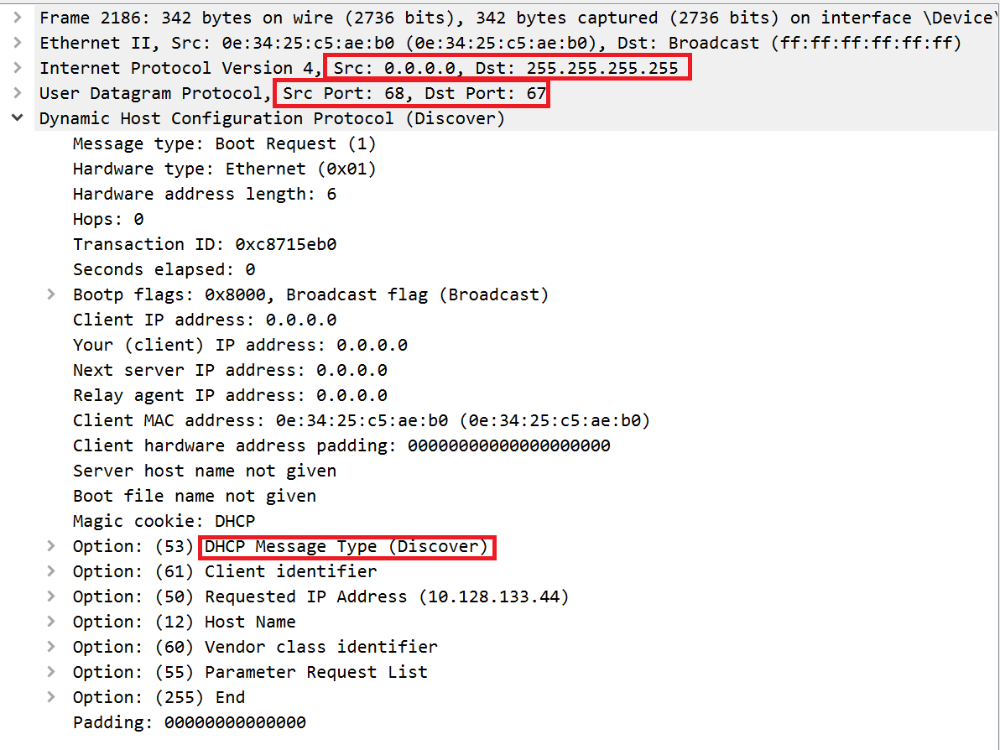
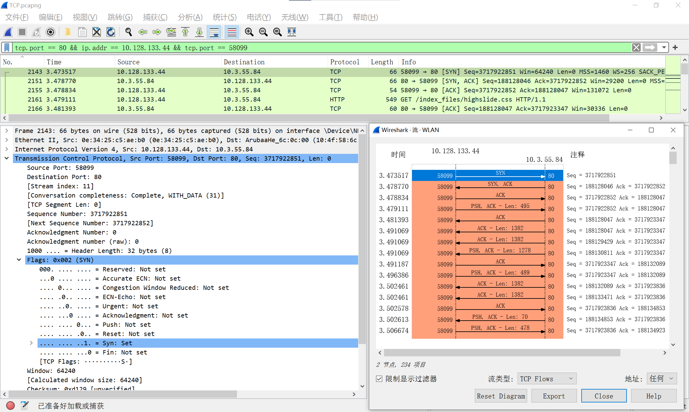

# 实验二  IP 和 TCP 数据分组的捕获和解析

---

## 实验内容和实验环境描述

> 描述本次实验的任务、内容和实验环境。

### 实验内容

1. 捕获在使用网络过程中产生的分组（packet）： IP 数据包、ICMP 报文、DHCP 报文、TCP 报文段。
2. 分析各种分组的格式，说明各种分组在建立网络连接和通信过程中的作用。
3. 分析 IP 数据报分片的结构：理解长度大于 1500 字节 IP 数据报分片传输的结构
4. 分析 TCP 建立连接、拆除连接和数据通信的过程。

### 实验环境

- Windows 10 64bit x64

- Wirshark Version 4.0.5

---

## 实验步骤和协议分析

### 0. 准备工作

1. 启动计算机，连接网络确保能够上网（为便于查找数据包和分析，不运行其他网络应用程序）
2. 运行 Wireshark，选择活跃的网卡（网络接口），我这里选择 `WLAN`

---

### 1. 捕获和分析 DHCP 报文

> 描述捕获方法及过程；描述 DHCP 协议的功能和分配 IP 地址的过程

#### DHCP 功能

DHCP（Dynamic Host Configuration Protocol，动态主机配置协议），前身是 BOOTP 协议，是一个局域网的网络协议，使用 UDP 协议工作，统一使用两个 IANA 分配的端口：**67（服务器端）**，**68（客户端）**。DHCP 通常被用于局域网环境，主要作用是集中的管理、分配 IP 地址，使 client 动态的获得 IP 地址、Gateway 地址、DNS 服务器地址等信息，并能够提升地址的使用率。简单来说，DHCP 就是一个不需要账号密码登录的、自动给内网机器分配IP地址等信息的协议。

#### 捕获方法及过程

1. 在 Wireshark 中设置捕获过滤器：`udp.port == 67`，开始监控。

2. 运行 cmd，进入命令行窗口，使用命令：`ipconfig /release`，释放主机的IP 地址，断网。此时 wireshark 的主窗口将显示一条DHCP 消息

   

3. 使用命令：`ipconfig /renew`，重新分配 IP 地址，此时 wireshark 的主窗口将显示 4 条 DHCP 消息

   

4. 停止捕获，保存捕获数据

5. 分析捕获到的 DHCP 报文的格式，理解 DHCP 的功能和分配 IP 地址的过程

#### 实验结果分析

释放主机当前 IP ，主机先向 DHCP 服务器发送 Release 请求报文，告知服务器用户不再需要分配IP地址，请求 DHCP 服务器释放对应的 IP 地址

- 可以看到 Release 请求的**源 IP 地址是释放前 IP**，**目的 IP 地址是 DHCP 服务器的地址**；**源端口为客户端端口号 68**，**目的端口为服务器端口号 67**，在协议头的可选字段中显示该报文为 **DHCP 的 Release 请求**


DHCP 重新分配 IP 地址，分为以下 4 个步骤：

1. 客户端首先发起 **DHCP 发现报文（DHCP DISCOVER）** 的 IP 数据报，由于客户端没有 IP 地址，也不知道 DHCP 服务器的地址，因此DHCP客户端会在本地网络内以广播方式发送Discover请求报文，以发现网络中的DHCP服务器。所有收到Discover报文的DHCP服务器都会发送应答报文，DHCP客户端据此可以知道网络中存在的DHCP服务器的位置。所以使用的是 **UDP 广播通信**，其使用的广播**目的地址是 255.255.255.255（端口 67）** 并且使用 **0.0.0.0（端口 68） 作为源 IP 地址**。DHCP 客户端将该 IP 数据报传递给链路层，链路层然后将帧广播到所有的网络中设备。

   

2. DHCP 服务器收到 Discover 报文后，就会在所配置的地址池中查找一个合适的 IP 地址，加上相应的租约期限和其他配置信息（如**可租约的 IP 地址**、**IP 地址租用期**、**子网掩码**、**默认网关**、**DNS 服务器**等），构造一个Offer报文，发送 **DHCP 提供报文（DHCP OFFER）** 向客户端做出响应。该报文仍然使用 **IP 广播地址 255.255.255.255**，告知用户本服务器可以为其提供 IP 地址。但这个报文只是告诉 DHCP 客户端可以提供 IP 地址，最终还需要客户端通过 ARP 来检测该 IP 地址是否重复。

   

3. 客户端收到一个或多个服务器的 DHCP 提供报文后，从中选择一个服务器，并向选中的服务器发送 **DHCP 请求报文（DHCP REQUEST**进行响应，回显配置的参数。DHCP客户端可能会收到很多Offer请求报文，所以必须在这些应答中选择一个。通常是选择第一个 Offer 应答报文的服务器作为自己的目标服务器，并向该服务器发送一个广播的 Request 请求报文，通告选择的服务器，希望获得所分配的 IP 地址。另外，DHCP 客户端在成功获取IP地址后，在地址使用租期达到 50% 时，会向 DHCP 服务器发送单播 Request 请求报文请求续延租约，如果没有收到 ACK 报文，在租期达到 87.5% 时，会再次发送广播的 Request 请求报文以请求续延租约。

   

4. 最后，服务端用 **DHCP ACK 报文**对 DHCP 请求报文进行响应，应答所要求的参数。DHCP 服务器收到 Request 请求报文后，根据 Request 报文中携带的用户 MAC 来查找有没有相应的租约记录，如果有则发送 ACK 应答报文，通知用户可以使用分配的 IP 地址。一旦客户端收到 DHCP ACK 后，交互便完成了，并且客户端能够在租用期内使用 DHCP 服务器分配的 IP 地址。

   

---

### 2. 捕获和分析 ICMP 报文

> 描述捕获方法及过程，描述 ICMP 报头的格式及各字段的作用。

#### ICMP 功能及报文格式

ICMP 是 “Internet Control Message Protocol”（Internet 控制报文协议）的缩写。它是 TCP/IP 协议族的一个子协议，用于在 IP 主机、路由器之间传递控制消息。控制消息是指网络通不通、主机是否可达、路由是否可用等网络本身的消息。这些控制消息虽然并不传输用户数据，但是对于用户数据的传递起着重要的作用。

ICMP 协议的功能主要有：

1. 确认 IP 包是否成功到达目标地址
2. 通知在发送过程中 IP 包被丢弃的原因

我们需要注意几点：

1. ICMP 是基于 IP 协议工作的，但是它并不是传输层的功能，因此仍然把它归结为网络层协议

2. ICMP 只能搭配 IPv4 使用，如果是 IPv6 的情况下, 需要是用 ICMPv6

ICMP 大概分为两类报文：

- 查询报文类型
  - 回送请求（Echo Request）
  - 回送应答（Echo Replay）
- 差错报文类型
  - 目标不可达（Destination Unreachable）
  - 原点抑制（Source Quench）
  - 重定向或改变路由（Redirect）
  - 超时（Time Exceeded）

ICMP 报文格式

- 类型（8 位）：标识 ICMP 报文所属的种类
- 代码（8 位）：与类型字段相结合，定义详细的报文类型
- 校验和（16 位）
- 数据字段（不定长）：根据报文种类决定携带的数据


#### 捕获方法及过程

1. 在主窗口设置显示过滤器为：icmp，从而只显示 icmp 报文，不显示其他协议数据

2. 开启 wireshark 监控，使用 ping 命令, 捕获 ICMP 分组

   

3. 开启 wireshark 监控，使用 tracert 命令, 捕获 ICMP 分组

   

4. 停止监控，分析其格式

#### 实验结果分析

##### ping —— 查询报文类型的使用

**回送消息 (Echo)** 用于进行通信的主机或路由器之间，判断所发送的数据包是否已经成功到达对端的一种消息，`ping` 命令就是利用这个消息实现的


相比原生的 ICMP，这里多了两个字段：

- **标识符**：用以区分是哪个应用程序发 ICMP 包，比如用进程 `PID` 作为标识符；
- **序号**：序列号从 `0` 开始，每发送一次新的回送请求就会加 `1`， 可以用来确认网络包是否有丢失。

在**选项数据**中，`ping` 还会存放发送请求的时间值，来计算往返时间，说明路程的长短。

**下面分析 ping 命令执行过程**：

使用 ping 命令 ping 学校官网

```shell
ping www.bupt.edu.cn

正在 Ping vn46.bupt.edu.cn [211.68.69.240] 具有 32 字节的数据:
来自 211.68.69.240 的回复: 字节=32 时间=1688ms TTL=59
来自 211.68.69.240 的回复: 字节=32 时间=1725ms TTL=59
请求超时。
来自 211.68.69.240 的回复: 字节=32 时间=1591ms TTL=59

211.68.69.240 的 Ping 统计信息:
    数据包: 已发送 = 4，已接收 = 3，丢失 = 1 (25% 丢失)，
往返行程的估计时间(以毫秒为单位):
    最短 = 1591ms，最长 = 1725ms，平均 = 1668ms
```

ping 命令执行的时候，源主机首先会构建一个 **ICMP 回送请求消息（Echo Request）**数据包

ICMP 数据包内包含多个字段，最重要的是两个：

- 第一个是**类型 (Type)**，对于回送请求消息而言该字段为 `8`
- 另外一个是**序号 (Sequence Number)**，主要用于区分连续 ping 的时候发出的多个数据包，。每发出一个请求数据包，序号会自动加 `1`。为了能够计算往返时间 `RTT`，它会在报文的数据部分插入发送时间

根据抓到的第一个 ICMP 包，可以看到目前这个报文的序号为 `214`


目的主机会构建一个 **ICMP 回送响应消息（Echo Reply）**数据包

- 回送响应数据包的**类型**字段为 `0`
- **序号**为接收到的请求数据包中的序号

根据抓到的第二个 ICMP 包，可以看到这个报文序号与之前的请求报文序号一致，也为 `214`


第三个包是源主机再发了一个请求，但是没有回应

可以看到的是**序号 (Sequence Number) **字段自动加一变成了 `215`


之后的报文均与上类似

##### tracert —— 差错报文类型的使用

Windows 下使用 `tracert` 命令来追踪途径路由

tracert 的一个作用是**故意设置特殊的 TTL，来追踪去往目的地时沿途经过的路由器。**其参数指向某个**目的 IP 地址**。

它的原理就是利用 IP 包的**生存期限** 从 `1` 开始按照顺序递增的同时发送 **UDP 包**，强制接收 **ICMP 超时消息**的一种方法。比如，将 TTL 设置 为 `1`，则遇到第一个路由器，就牺牲了，接着返回 ICMP 差错报文网络包，类型是**时间超时**。接下来将 TTL 设置为 `2`，第一个路由器过了，遇到第二个路由器也牺牲了，也同时返回了 ICMP 差错报文数据包，如此往复，直到到达目的主机。这样的过程，tracert 就可以拿到了所有的路由器 IP

tracert 在发送 UDP 包时，会填入一个**不可能的端口号**值作为 UDP 目标端口号：`33434`。然后对于每个下一个探针，它都会增加一个，这些端口都是通常认为不会被使用，不过，没有人知道当某些应用程序监听此类端口时会发生什么。当目的主机，收到 UDP 包后，会返回 ICMP 差错报文消息，但这个差错报文消息的类型是「**端口不可达**」。所以，**当差错报文类型是端口不可达时，说明发送方发出的 UDP 包到达了目的主机。**

所以使用 `tracert` 跟踪途径路由，应该可以看到**超时消息**、**端口不可达**这两种 ICMP 差错报文类型

这里以学校的公网 IP 为例，接下来看执行 tracert 命令后都有哪些包

```shell
tracert 211.68.69.240

通过最多 30 个跃点跟踪
到 vn.bupt.edu.cn [211.68.69.240] 的路由:

  1     *        *        *     请求超时。
  2     4 ms     3 ms     3 ms  10.0.28.1
  3     2 ms     3 ms     3 ms  10.0.4.21
  4     *        *        3 ms  10.0.3.17
  5     4 ms     4 ms     3 ms  172.16.3.129
  6  1707 ms  1702 ms     *     vn.bupt.edu.cn [211.68.69.240]
  7  1729 ms     *        *     vn.bupt.edu.cn [211.68.69.240]
  9     *        *     1739 ms  vn.bupt.edu.cn [211.68.69.240]
```

回送类型报文在 ping 命令中已经讨论过，接下来只看差错报文类型。在 Wireshark 中，差错报文是由黑色标识

首先看到一个**超时消息**，报文格式中重要信息如下：

- **类型 (Type) **字段的值为 `11`
- **代码 (Code) **字段的值为 `0`
- **生存期 (Time to Live) **字段的值为 `1`


接下来还有一个**目的端口不可达**差错报文：

- **类型**：`3` 目标不可达消息
- **代码**：`3` 端口不可达代码

这就说明到达了目的主机


之后的报文均与以上类似

---

### 3. IP 包的分段功能的分析

> 描述捕获方法及过程，描述所有分片的包长度、DF、段标识、MF、偏移量的值。

#### 捕获方法及过程

运行 cmd，进入命令行窗口，使用命令：`ping -l 8000` 域名（如 www.bupt.edu.cn）

```shell
ping -l 8000 www.bupt.edu.cn

正在 Ping vn46.bupt.edu.cn [211.68.69.240] 具有 8000 字节的数据:
来自 211.68.69.240 的回复: 字节=8000 时间=4ms TTL=59
请求超时。
请求超时。
请求超时。

    数据包: 已发送 = 4，已接收 = 1，丢失 = 3 (75% 丢失)，
往返行程的估计时间(以毫秒为单位):
    最短 = 4ms，最长 = 4ms，平均 = 4ms
```

制作 8000 字节的 IP 数据报并发送，捕获后分析其分片传输的分组结构


#### 实验结果分析

来看 ping 命令执行后发送的所有分组

下面是 Wireshark 中序号为 108 的数据帧，这是发出的**第一片**数据帧：

- 帧长为 **1514 字节**（14 + 20 + 1480）
- IP 分组长度为 **1500** 字节，其中头部 **20 字节**
- offset 字段为 **0**，说明是第一片分段（回忆 IP 首部格式：offset 字段**以 8 字节为单位**表示当前分组是原数据帧数据偏移量的位置）
  - **DF = 0** 允许分段
  - **MF = 1** 不是最后一段
- 最后也标明了去掉 IP 首部后该 IP 分组内的数据载荷部分为 **1480 字节**


下面是 Wireshark 中序号为 109 的数据帧，这是发出的**第二片**数据帧：

- 帧长为 **1514 字节**（14 + 20 + 1480）
- IP 分组长度为 **1500** 字节，其中头部 **20 字节**
- offset 字段为 1011 1001 B = 185 D，185 * 8 = **1480**，说明是第二片分段（回忆 IP 首部格式：offset 字段**以 8 字节为单位**表示当前分组是原数据帧数据偏移量的位置）
  - **DF = 0** 允许分段
  - **MF = 1** 不是最后一段
- 最后也标明了去掉 IP 首部后该 IP 分组内的数据载荷部分为 **1480 字节**


下面是 Wireshark 中序号为 110 的数据帧，这是发出的**第三片**数据帧：

- 帧长为 **1514 字节**（14 + 20 + 1480）
- IP 分组长度为 **1500** 字节，其中头部 **20 字节**
- offset 字段为 0001 0111 0010 B = 370 D，370 * 8 = **2096**，说明是第三片分段（回忆 IP 首部格式：offset 字段**以 8 字节为单位**表示当前分组是原数据帧数据偏移量的位置）
  - **DF = 0** 允许分段
  - **MF = 1** 不是最后一段
- 最后也标明了去掉 IP 首部后该 IP 分组内的数据载荷部分为 **1480 字节**


下面是 Wireshark 中序号为 111 的数据帧，这是发出的**第四片**数据帧：

- 帧长为 **1514 字节**（14 + 20 + 1480）
- IP 分组长度为 **1500** 字节，其中头部 **20 字节**
- offset 字段为 0010 0010 1011 B = 555 D，555 * 8 = **4440**，说明是第四片分段（回忆 IP 首部格式：offset 字段**以 8 字节为单位**表示当前分组是原数据帧数据偏移量的位置）
  - **DF = 0** 允许分段
  - **MF = 1** 不是最后一段
- 最后也标明了去掉 IP 首部后该 IP 分组内的数据载荷部分为 **1480 字节**


下面是 Wireshark 中序号为 112 的数据帧，这是发出的**第五片**数据帧：

- 帧长为 **1514 字节**（14 + 20 + 1480）
- IP 分组长度为 **1500** 字节，其中头部 **20 字节**
- offset 字段为 0010 1110 0100 B = 740 D，740 * 8 = **5920**，说明是第五片分段（回忆 IP 首部格式：offset 字段**以 8 字节为单位**表示当前分组是原数据帧数据偏移量的位置）
  - **DF = 0** 允许分段
  - **MF = 1** 不是最后一段
- 最后也标明了去掉 IP 首部后该 IP 分组内的数据载荷部分为 **1480 字节**


下面是 Wireshark 中序号为 113 的数据帧，这是发出的**第六片**数据帧，也是最后一段数据帧：

- 帧长为 **642 字节**（14 + 20 + 8 + 600）
- IP 分组长度为 **628** 字节，其中头部 **20 字节**
- offset 字段为 0011 1001 1101 B = 925 D，925 * 8 = **7400**（回忆 IP 首部格式：offset 字段**以 8 字节为单位**表示当前分组是原数据帧数据偏移量的位置）
  - **DF = 0** 允许分段
  - **MF = 0** 是最后一段
- 数据载荷部分是 **8 字节**的 ICMP 回送请求（Echo Request）报头，含有 1 字节类型、1 字节代码、2 字节校验和、2 字节标识符、2 字节序列号
- ICMP 报头之后是剩余的 **600 字节**数据字段，所有重组后的数据字段总长 **8000 字节**（1480 * 5 + 600）


这个 ICMP 回送请求报文（Echo Request）也收到了回送应答报文（Echo Reply），说明这些数据都发送成功

---

### 4. TCP 建立连接和释放连接的分析

>  描述捕获方法及过程，画出 TCP 建立连接和释放连接的消息序列图，表明各消息中 SYN、ACK、FIN、发送序号、确认序号的值。

#### 捕获方法及过程

开启 wireshark 监控，打开一个网页，停止监控

关闭使用相对序列号显示，观察真实的序列号：


分析捕获到的 TCP 报文段，在 统计 -> 流量图 中可以清晰地看到整个报文的传输时序流程：



#### 实验结果分析

##### TCP 连接的建立 —— 三次握手

第一步：客户端会随机初始化序号（`client_isn`），将此序号置于 TCP 首部的「序号」字段中，同时把 `SYN` 标志位置为 `1`，表示 `SYN` 报文。接着把第一个 SYN 报文发送给服务端，表示向服务端发起连接，该报文不包含应用层数据，之后客户端处于 `SYN-SENT` 状态

可以看到 SYN 报文的详细信息：

- ACK = **0**，RST = **0**，SYN = **1**，FIN = **0**
- Seq Num = **3717922851**
- Ack Num = **0**


第二步：服务端收到客户端的 `SYN` 报文后，首先服务端也随机初始化自己的序号（`server_isn`），将此序号填入 TCP 首部的「序号」字段中，其次把 TCP 首部的「确认应答号」字段填入 `client_isn + 1`, 接着把 `SYN` 和 `ACK` 标志位置为 `1`。最后把该报文发给客户端，该报文也不包含应用层数据，之后服务端处于 `SYN-RCVD` 状态

可以看到 SYN + ACK 报文的详细信息：

- ACK = **1**，RST = **0**，SYN = **1**，FIN = **0**
- Seq Num = **188128046**
- Ack Num = **3717922852**（= 371922851 + 1）


第三步：客户端收到服务端报文后，还要向服务端回应最后一个应答报文，首先该应答报文 TCP 首部 `ACK` 标志位置为 `1` ，其次「确认应答号」字段填入 `server_isn + 1` ，最后把报文发送给服务端，这次报文可以携带客户到服务端的数据，之后客户端处于 `ESTABLISHED` 状态。服务端收到客户端的应答报文后，也进入 `ESTABLISHED` 状态

可以看到 ACK 报文的详细信息：

- ACK = **1**，RST = **0**，SYN = **0**，FIN = **0**
- Seq Num = **3717922852**
- Ack Num = **188128047**（= 188128046+ 1）


##### TCP 连接的释放 —— 四次挥手

第一步：客户端打算关闭连接，此时会发送一个 TCP 首部 `FIN` 标志位被置为 `1` 的报文，也即 `FIN` 报文，之后客户端进入 `FIN_WAIT_1` 状态

第二步：服务端收到该报文后，就向客户端发送 `ACK` 应答报文，接着服务端进入 `CLOSE_WAIT` 状态。客户端收到服务端的 `ACK` 应答报文后，之后进入 `FIN_WAIT_2` 状态

第三步：等待服务端处理完数据后，也向客户端发送 `FIN` 报文，之后服务端进入 `LAST_ACK` 状态

第四步：客户端收到服务端的 `FIN` 报文后，回一个 `ACK` 应答报文，之后进入 `TIME_WAIT` 状态。服务端收到了 `ACK` 应答报文后，就进入了 `CLOSE` 状态，至此服务端已经完成连接的关闭。客户端在经过 `2MSL` 一段时间后，自动进入 `CLOSE` 状态，至此客户端也完成连接的关闭

可以看到，每个方向都需要**一个 FIN 和一个 ACK**，因此通常被称为**四次挥手**

但是，在实验过程中，尤其是 HTTP 协议中，几乎只能看到三次挥手，很难找到标准的四次挥手。经查阅资料发现：当被动关闭方（上图的服务端）在 TCP 挥手过程中，「**没有数据要发送」并且「开启了 TCP 延迟确认机制」，那么第二和第三次挥手就会合并传输，这样就出现了三次挥手。**因为 TCP 延迟确认机制是默认开启的，所以导致我们抓包时，看见三次挥手的次数比四次挥手还多。

接下来看我抓到包的详细内容：

第一步：主动关闭方发 FIN 报文，详细内容如下：

- ACK = **1**，RST = **0**，SYN = **0**，FIN = **1**
- Seq Num = **3717932342**
- Ack Num = **188350793**（这里可以看出还使用了延迟确认，类似于数据链路层的稍带确认）


第二步：被动关闭方收到 FIN 报文，发 FIN 和 ACK（没有数据要发送或开启了 TCP 延迟确认机制），详细内容如下：

- ACK = **1**，RST = **0**，SYN = **0**，FIN = **1**
- Seq Num = **188350793**
- Ack Num = **3717932343**（= 3717932342 + 1）


第三步：主动关闭方发 ACK，等待 2MSL 时间后关闭，被动方收到 ACK 直接关闭。详细内容如下：

- ACK = **1**，RST = **0**，SYN = **0**，FIN = **0**
- Seq Num = **3717932343**
- Ack Num = **188350794**（= 188350793 + 1）


---

## 实验结论和实验心得

>  如果一切顺利，完成本次实验工作大约需要 2 ~ 3 个小时。你用的时间是否超过这个预测？描述在实验过程中遇到的问题和解决的方法。总结本次实验，你有哪些收获？

### 实验总结

进行试验并保存抓包文件的时间不超过 1 个小时，但为了写好整篇报告，在作图和查资料并撰写报告上的时间花了 3 小时左右

实验中遇到问题主要出现在 TCP 抓包的过程中，有以下几个方面的问题：

- 个人电脑上的网络进程太多，即使所有网页都关掉且关掉电脑上所有需要使用网络的客户端软件，只留一个实验网页，还是会看到当过滤器语句只写一个 `tcp` 时会有太多的 TCP 报文，导致无法清楚地看到完整的 TCP 建立连接和释放连接的过程
- 即使是相同的源 IP 地址和目的 IP 地址，也可能出现端口号不同的情况导致不是一个连接中的 TCP 报文杂糅在一起，难以观察

解决方法：

- 使用过滤器语法 `tcp.port == 80 && ip.addr == 10.128.133.44 && tcp.port == 58099` 限制好源 IP 地址、源端口号、目的端口号，就可以保证过滤出来的报文全部都是同一个连接的 TCP 报文，便于观察

### 心得体会

经过此次实验对 IP 分组和 TCP 分组的捕获和分析，我有以下收获：

- 掌握了 Wireshark 这款网络分析工具的基本使用方法
- 具备了基本的网络分析能力，感到工程技术水平有明显提升
- 对 DHCP 协议的工作流程、报文格式有了清晰的认识
- 对 ICMP 报文的两大分类和典型应用（ping，tracert）有了更深的理解
- 对 IP 分组分片的过程和计算有了更清晰的认识
- 对 TCP 连接的建立和释放过程有了更深的理解

---

## 参考资料

- [DHCP协议详解 - nwatch的文章 - 知乎](https://zhuanlan.zhihu.com/p/265293856)
- [ICMP协议详解 - nwatch的文章 - 知乎](https://zhuanlan.zhihu.com/p/265282626)
- [5.1 IP 基础知识全家桶 | 小林coding](https://xiaolincoding.com/network/4_ip/ip_base.html#dhcp)
- [4.3 TCP 实战抓包分析 | 小林coding](https://xiaolincoding.com/network/3_tcp/tcp_tcpdump.html#解密-tcp-三次握手和四次挥手)
- [4.22 TCP 四次挥手，可以变成三次吗？ | 小林coding](https://xiaolincoding.com/network/3_tcp/tcp_three_fin.html)
